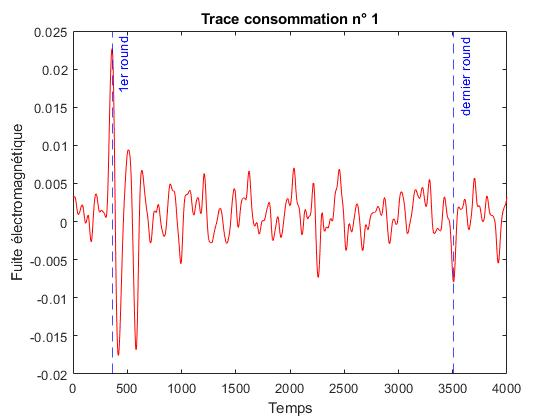
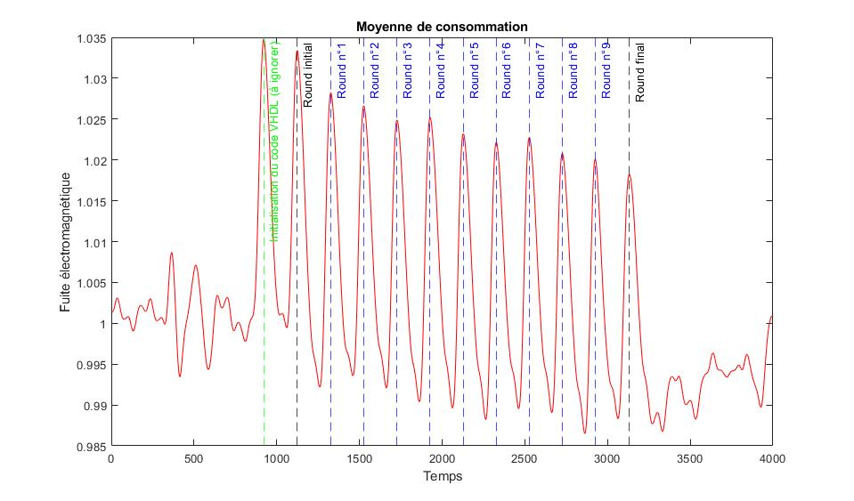
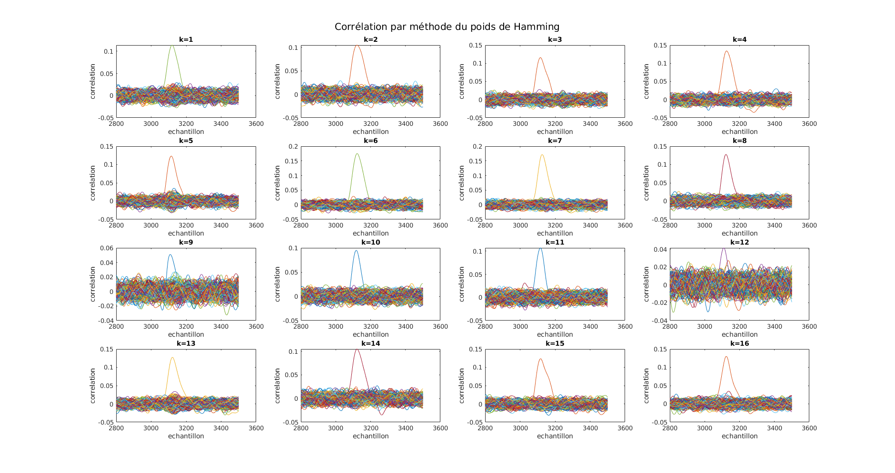

# Attaque AES 128 bits 

Auteurs : 

* Guillaume LEINEN
* Alexandre FROEHLICH

## Introduction au projet

Le projet a pour but la mise en place d'une attaque matériel de type CPA-DPA par canaux auxiliaire sur un FPGA inconnu. L'objectif étant de retrouver les sous clés ou la clé entière en analysant les traces de consommations déduite du rayonnement électromagnétique de l'objet. 

Nous disposons pour cela de 20000 mesures de 20000 textes clairs et 20000 textes chiffrés. Il s'agit donc d'une attaque par clair connu.

## Déroulé de l'attaque

Avant d'attaquer les fuites obtenues pendant les campagnes de mesure, on désire avoir un aperçu des données capturés afin d'émettre quelques hypothèses. On commence donc par afficher l'une des 20000 mesures de courant. 



On constate d'effectivement des variations de courant, correspondant à l'algorithme de chiffrement AES. On pourrait chercher à estimer un début et une fin de chiffrement, en effet le processus de basculement des transistors pour charger et décharger les clés et textes consomme du courant.

En revanche il est **impossible de conclure sur les positions exactes des rounds** pour TOUTES les mesures car le texte en clair choisi n'est pas le même pour chaque mesure, ce qui modifie évidemment la durée de calcul. Il faudra donc passer par une moyenne pour avoir une meilleure idée relative des différents temps du déroulé de l'algorithme. 

 

En effet, on voit mieux les pics correspondant aux rounds de l'algorithme AES. Seul un pic est présent en trop, il s'agit de l'initialisation du code VHDL, et il est donc à ignorer dans notre attaque. 

On observe que le premier round se situe aux alentour **des points 1200-1400**. On peut donc conclure que le dernier round, sur lequel on va baser notre attaque, se situe aux alentours  **des points 2700-3200**.

Pour la suite de l'attaque nous allons générer l'ensemble des clés possibles. Ce seront nos **hypothèses de clé**. La clé étant composée de 16 paires d'octets cela représente 256 bits possible fois 16 morceaux de clés. Si on applique cette logique pour les 20 000 fuites obtenues, nos hypothèses de travail formeront un tableau de taille $20000\times256\times16$.


Pour chaque morceau de cette clé que l’on va appeler “valeur intermédiaire”, nous allons appliquer l’inverse des étapes du dernier round de l’AES. C’est a dire que nous allons faire :

* XOR sur le chiffré à partir de notre hypothèse de clé
* `shiftrow` inverse sur ce résultat
* `subbyte` inverse sur ce dernier résultat

Enfin pour trouver le candidat idéal correspondant à notre morceau de clé nous allons appliquer la méthode du poids de Hamming sur le résultat puis ensuite on va corréler ce poids avec les fuites mesurées sur le dernier round. De la devrait se dégager un candidat du reste du lot qui sera notre morceau de clé.

Pour vérifier que l’on a trouvé la bonne sous-clé à la fin, nous allons la calculer à partir de la clé qui nous est fournie pour chaque fuite. Ainsi la dernière sous-clé à retrouver est : 

```matlab
    60    64    77    37
    71   214    56   251
    64   128     0   120
     1   146   185   176
```

Sachant que nous allions réutiliser souvent les mêmes résultats de calculs justes, nous avons décidé de mettre en cache certains de ces résultats par le biais des fonction `load()`, `save()` et `exists()` pour vérifier si le fichier existe ou encore si la variable a déjà été chargé dans l’espace de travail.

Ainsi un lancement *à froid* du programme donnera une sortie équivalente à celle-ci :

```
Converting data to high performance files (this will be done only once)
Processing:  100%  |██████████████████████████████████| 20000/20000it [00:14:39<00:00:00, 22.75 it/s]
Creating a single file with all data into it
Processing:  100%  |██████████████████████████████████| 20000/20000it [00:01:58<00:00:00, 168.48 it/s]
Saving file to cache
-- 1) Tracé d'une seule courbe
-- 2) Calcul d'une moyenne des traces
Calcul de la moyenne
Processing:  100%  |██████████████████████████████████| 20000/20000it [00:01:47<00:00:00, 186.59 it/s]
Mise en cache de la moyenne
-- 5) Prédiction d'état
```

Alors qu’un lancement à chaud (variable déjà chargées dans l’espace de travail) donnera une exécution près de 11x plus rapide et une sortie équivalente : 

```
No need to convert data as it has already be done.
-- 1) Tracé d'une seule courbe
-- 2) Calcul d'une moyenne des traces
Loading moyenne from cache
-- 5) Prédiction d'état
```

Là où nous avions eu du mal était dans l’assemblage des différentes briques composant l’attaque. Notamment l’application du poids de Hamming. Une fois ces quelques soucis réglés nous somme passé de 1 à 2 clés trouvées à 16 morceaux de clés trouvés à chaque essai. Les graphiques suivants sont les résultats obtenus pour chaque morceau de clé.



On observe sur la figure précédente qu’il y a bien à chaque fois un candidat qui se démarque du reste. On peut donc être confiant de le résultat de la corrélation.